# Smart Knowledge Repository

An intelligent knowledge management system that demonstrates advanced data collection, storage optimization, intelligent retrieval, and scope-aware AI interactions using **Retrieval-Augmented Generation (RAG)**.

## 🏗️ System Architecture & Data Flow

The following diagram illustrates how data flows through the system from URL input to AI-powered responses:

```mermaid
graph TB
    %% Input Layer
    A[🌐 URL Input] --> B[Web Scraper]
    A1[📄 Manual Upload] --> B1[Document Processor]
    
    %% Data Collection & Processing
    B --> C[Content Extraction]
    B1 --> C
    C --> D[Data Validation]
    D --> E[Text Chunking]
    
    %% Storage Layer
    E --> F[SQLite Database]
    E --> G[Embedding Generation]
    
    %% Vector Storage
    G --> H[sentence-transformers<br/>all-MiniLM-L6-v2]
    H --> I[ChromaDB<br/>Vector Database]
    
    %% Query Processing
    J[👤 User Query] --> K[Domain Detection]
    K --> L[Query Optimization]
    L --> M[Scope Analysis]
    
    %% Search & Retrieval
    M --> N{Search Type}
    N -->|Semantic| O[ChromaDB<br/>Similarity Search]
    N -->|Keyword| P[SQLite<br/>Full-text Search]
    N -->|Hybrid| Q[Combined Search]
    
    %% RAG Pipeline
    O --> R[Document Retrieval]
    P --> R
    Q --> R
    R --> S[Context Preparation]
    S --> T[OpenAI GPT-4o-mini<br/>Response Generation]
    
    %% Output
    T --> U[🤖 AI Response<br/>with Citations]
    
    %% Storage Details
    F --> F1[Documents<br/>Metadata<br/>Categories]
    I --> I1[Vector Embeddings<br/>Semantic Index<br/>Domain Collections]
    
    %% Styling
    classDef input fill:#e1f5fe
    classDef processing fill:#f3e5f5
    classDef storage fill:#e8f5e8
    classDef ai fill:#fff3e0
    classDef output fill:#fce4ec
    
    class A,A1,J input
    class B,B1,C,D,E,K,L,M processing
    class F,F1,G,H,I,I1 storage
    class N,O,P,Q,R,S,T ai
    class U output
```



## 🔄 Detailed Process Flow

### **Phase 1: Data Ingestion**
1. **URL Input** → Web scraper extracts content using BeautifulSoup + aiohttp
2. **Content Processing** → Text validation, cleaning, and chunking (500 tokens with 50 overlap)
3. **Dual Storage**:
   - **SQLite**: Structured data (metadata, URLs, categories)
   - **ChromaDB**: Vector embeddings for semantic search

### **Phase 2: Embedding Generation**
1. **Text Chunking** → Documents split into semantic chunks
2. **Vectorization** → sentence-transformers converts text to 384-dim vectors
3. **Domain Classification** → Content categorized (Technology, Business, Science, etc.)
4. **Vector Storage** → Embeddings stored in ChromaDB collections by domain

### **Phase 3: Query Processing**
1. **User Query** → Natural language question/request
2. **Domain Detection** → AI determines query category and intent
3. **Query Optimization** → Remove stop words, extract key entities
4. **Scope Analysis** → Determine if query can be answered from knowledge base

### **Phase 4: Retrieval-Augmented Generation (RAG)**
1. **Semantic Search** → ChromaDB finds similar content using cosine similarity
2. **Hybrid Search** → Combines semantic + keyword search for best results
3. **Context Preparation** → Top relevant documents formatted for LLM
4. **AI Response** → OpenAI GPT-4o-mini generates contextual answer using retrieved knowledge
5. **Citation Generation** → Sources and confidence scores provided

## 📊 Key Components

### **🧠 AI & Machine Learning Stack**
- **Embeddings**: sentence-transformers (all-MiniLM-L6-v2) - 384 dimensional vectors
- **Vector Database**: ChromaDB with persistent storage and domain collections
- **LLM Integration**: OpenAI GPT-4o-mini for contextual response generation
- **Semantic Search**: Cosine similarity search with relevance scoring

### **🗄️ Data Storage Architecture** 
- **Primary Database**: SQLite for structured data and metadata
- **Vector Storage**: ChromaDB for semantic embeddings and similarity search
- **Domain Organization**: Separate collections for Technology, Business, Science, Healthcare, Education
- **Backup System**: Automated database backups and recovery

### **🌐 Web Scraping Engine**
- **Async HTTP Client**: aiohttp for efficient concurrent requests
- **Content Parser**: BeautifulSoup4 + lxml for robust HTML extraction
- **Rate Limiting**: Configurable delays and concurrent request limits
- **Content Validation**: Data quality checks and duplicate detection

### **🔍 Search Capabilities**
- **Semantic Search**: Find content by meaning, not just keywords
- **Hybrid Search**: Combines semantic + full-text search
- **Relevance Scoring**: Multi-factor scoring algorithm with confidence metrics
- **Domain Filtering**: Search within specific knowledge domains

## Features

- 🌐 **Structured Web Scraping**: Automated content discovery and extraction with rate limiting
- 🗄️ **Smart Storage**: SQLite + ChromaDB dual storage for structured and vector data
- 🔍 **Semantic Search**: AI-powered search that understands context and meaning
- 🤖 **RAG-Powered Chat**: Retrieval-Augmented Generation using OpenAI GPT-4o-mini
- 📊 **Analytics Dashboard**: Knowledge base statistics and search performance metrics
- 🎯 **Domain-Aware Processing**: Intelligent categorization and scope management
- 📱 **Multi-View Interface**: Search, Browse, Chat, and Management views

## 🔬 RAG Implementation Details

### **How Retrieval-Augmented Generation Works**

The system implements a sophisticated RAG pipeline that enhances AI responses with relevant knowledge:

1. **Query Understanding**
   - Domain detection determines content category (Technology, Business, etc.)
   - Intent classification identifies query type (factual, comparison, how-to)
   - Entity extraction finds key concepts for better search

2. **Intelligent Retrieval**
   - **Semantic Search**: Uses sentence-transformers to find conceptually similar content
   - **Hybrid Approach**: Combines semantic similarity with keyword matching
   - **Relevance Scoring**: Multi-factor algorithm considers similarity, freshness, and domain relevance

3. **Context Generation**
   - Retrieved documents are ranked by relevance scores
   - Top results are formatted into context for the LLM
   - Citation tracking maintains source attribution

4. **Response Generation**
   - OpenAI GPT-4o-mini generates responses using retrieved context
   - Responses include proper citations and confidence indicators
   - Knowledge gap detection identifies missing information

### **Similarity Score Interpretation**
- **0.30+**: Very good semantic match (high confidence)
- **0.20+**: Good semantic match (reliable results)
- **0.15+**: Acceptable semantic match (usable information)
- **< 0.15**: Poor match (low relevance warning)

## Quick Start

### Installation

```bash
# Clone the repository
git clone https://github.com/yourusername/smart-knowledge-repository.git
cd smart-knowledge-repository

# Create virtual environment
python -m venv venv
source venv/bin/activate  # On Windows: venv\Scripts\activate

# Install dependencies
pip install -r requirements.txt

# Download spaCy model
python -m spacy download en_core_web_sm
```

### Configuration

1. Copy `.env.example` to `.env` and update settings:
```bash
cp .env.example .env
```

2. Initialize the database:
```bash
python src/main.py
```

### Run the Application

#### Streamlit UI (Recommended)
```bash
streamlit run src/ui/streamlit_app.py
```

#### FastAPI Backend (Optional)
```bash
uvicorn src.api.main:app --reload
```

## Project Structure

```
smart-knowledge-repository/
├── src/
│   ├── core/              # Core configuration and database
│   ├── storage/           # Data storage and management
│   ├── crawlers/          # Web scraping and content extraction
│   ├── processors/        # Text processing and validation
│   ├── search/            # Search engine and relevance scoring
│   ├── ai/               # AI context management and scope handling
│   └── ui/               # Streamlit user interface
├── schemas/              # Database schemas
├── tests/               # Unit and integration tests
├── data/               # Database and embeddings storage
└── logs/               # Application logs
```

## 💡 Complete Usage Example

Here's a step-by-step example showing the entire data flow:

### **Step 1: Data Ingestion**
```bash
# 1. Input URL for scraping
URL: "https://en.wikipedia.org/wiki/Artificial_intelligence"

# 2. Web scraper extracts content
→ Title: "Artificial intelligence - Wikipedia"
→ Content: "Artificial intelligence (AI) is the intelligence exhibited by machines..."
→ Metadata: URL, timestamp, language detection

# 3. Content processing
→ Text chunking: Split into 500-token chunks with 50-token overlap
→ Validation: Check quality, detect duplicates
→ Domain classification: Categorized as "Technology"
```

### **Step 2: Storage & Embedding**
```bash
# 4. Dual storage
SQLite Database:
  ├── documents table: ID=1, title, URL, content, category="Technology"
  ├── document_categories: Links document to Technology category
  └── metadata: Storage timestamp, content hash

ChromaDB Vector Database:
  ├── technology collection: Domain-specific embeddings
  ├── Chunk 1: [0.1, 0.3, -0.2, ...] (384 dimensions)
  ├── Chunk 2: [0.4, -0.1, 0.5, ...] (384 dimensions)
  └── Document metadata with chunk positions
```

### **Step 3: User Query Processing**
```bash
# 5. User asks question
User Query: "What is artificial intelligence?"

# 6. Query processing pipeline
→ Domain Detection: "general" domain, confidence: 0.0
→ Intent Classification: "factual" intent, confidence: 0.8
→ Query Optimization: "artificial intelligence" (removed stop words)
→ Scope Analysis: PARTIAL_SCOPE (content available)
```

### **Step 4: RAG Retrieval & Response**
```bash
# 7. Semantic search in ChromaDB
→ Query embedding: [0.2, 0.4, -0.1, ...] (384 dimensions)
→ Similarity search: Cosine similarity with stored embeddings
→ Results found:
   • "Artificial intelligence - Wikipedia" (Score: 0.32) ✅
   • "AI in Business Applications" (Score: 0.27) ✅
   • "Machine Learning Basics" (Score: 0.16) ✅

# 8. Context preparation for LLM
Context: """
Based on the following sources:
[1] Artificial intelligence (AI) is the intelligence exhibited by machines...
[2] AI applications in business include automation and decision-making...
[3] Machine learning is a subset of AI that enables computers to learn...
"""

# 9. OpenAI GPT-4o-mini generates response
AI Response: """
Artificial intelligence (AI) refers to the intelligence exhibited by machines [1]. 
It encompasses various approaches including machine learning [3] and has applications 
in business automation and decision-making [2].

📚 Sources:
• Artificial intelligence - Wikipedia (Score: 0.32)
• AI in Business Applications (Score: 0.27)  
• Machine Learning Basics (Score: 0.16)
"""
```

## Usage

### 1. Adding Content

**Web Scraping:**
- Navigate to Data Management → Web Scraping
- Enter a URL to scrape
- Set maximum depth and pages
- Start scraping process

**Manual Upload:**
- Go to Data Management → Add Content
- Fill in document details
- Submit to add to knowledge base

### 2. Searching Knowledge

**Basic Search:**
- Use the Search page
- Enter keywords or phrases
- Filter by category
- View relevance-scored results

**AI Chat:**
- Go to Chat Interface
- Ask natural language questions
- Get context-aware responses with sources

### 3. Managing Knowledge

**Browse Documents:**
- View all documents by category
- Filter and sort options
- Edit or delete documents

**Analytics:**
- Monitor usage patterns
- View search trends
- Analyze knowledge coverage

## Configuration

### Environment Variables

Create a `.env` file with:

```env
# Database
SQLITE_DB_PATH=data/knowledge.db
VECTOR_DB_PATH=data/embeddings/

# AI/ML
EMBEDDING_MODEL=all-MiniLM-L6-v2
CHUNK_SIZE=500
CHUNK_OVERLAP=50

# Scraping
MAX_CRAWL_DEPTH=3
CRAWL_DELAY=1.0
MAX_CONCURRENT_REQUESTS=5

# Security
SECRET_KEY=your-secret-key-here
```

### Customization

#### Adding New Categories
```python
# In src/storage/storage_manager.py
storage_manager.create_category(
    name="Custom Category",
    description="Your category description",
    color="#custom-color"
)
```

#### Custom Domain Keywords
```python
# In src/core/config.py
knowledge_domains = {
    "your_domain": ["keyword1", "keyword2", "keyword3"]
}
```

## 🏛️ Technical Architecture

```mermaid
graph LR
    %% User Interface Layer
    subgraph "🖥️ User Interface"
        UI[Streamlit App]
        API[FastAPI Backend]
    end
    
    %% Application Layer
    subgraph "🧠 Application Layer"
        SM[Storage Manager]
        SE[Search Engine]
        CB[Scope-Aware Chatbot]
        WS[Web Scraper]
    end
    
    %% AI/ML Layer
    subgraph "🤖 AI/ML Services"
        EG[Embedding Generator<br/>sentence-transformers]
        DD[Domain Detector]
        QO[Query Optimizer]
        OAI[OpenAI GPT-4o-mini]
    end
    
    %% Data Layer
    subgraph "🗄️ Data Storage"
        SQLite[(SQLite Database<br/>Documents & Metadata)]
        ChromaDB[(ChromaDB<br/>Vector Embeddings)]
        FS[File System<br/>Logs & Backups]
    end
    
    %% External
    subgraph "🌐 External Services"
        Web[Websites & APIs]
        OpenAI[OpenAI API]
    end
    
    %% Connections
    UI --> SM
    UI --> SE
    UI --> CB
    API --> SM
    API --> SE
    
    SM --> SQLite
    SM --> EG
    SE --> ChromaDB
    SE --> SQLite
    CB --> SE
    CB --> DD
    CB --> QO
    CB --> OAI
    
    WS --> Web
    WS --> SM
    EG --> ChromaDB
    OAI --> OpenAI
    
    %% Styling
    classDef ui fill:#e3f2fd
    classDef app fill:#f3e5f5
    classDef ai fill:#fff3e0
    classDef data fill:#e8f5e8
    classDef external fill:#fce4ec
    
    class UI,API ui
    class SM,SE,CB,WS app
    class EG,DD,QO,OAI ai
    class SQLite,ChromaDB,FS data
    class Web,OpenAI external
```



## API Documentation

### Search Documents
```bash
curl -X POST "http://localhost:8000/search" \
  -H "Content-Type: application/json" \
  -d '{"query": "machine learning", "max_results": 10}'
```

### Add Document
```bash
curl -X POST "http://localhost:8000/documents" \
  -H "Content-Type: application/json" \
  -d '{"title": "Document Title", "content": "Document content...", "url": "https://example.com"}'
```

## Development

### Running Tests
```bash
python -m pytest tests/
```

### Code Quality
```bash
# Linting
flake8 src/

# Type checking
mypy src/
```

### Contributing

1. Fork the repository
2. Create a feature branch
3. Make your changes
4. Add tests
5. Submit a pull request

## Architecture

### Data Flow
1. **Content Ingestion**: Web scraping or manual upload
2. **Validation**: Data validation and normalization
3. **Storage**: SQLite database with metadata
4. **Indexing**: Vector embeddings generation
5. **Search**: Hybrid keyword + semantic search
6. **AI Processing**: Context-aware response generation

### Security Features
- Input validation and sanitization
- SQL injection prevention
- Rate limiting for scraping
- Secure file handling

## Performance

### Optimization Tips
- Regular database maintenance
- Vector index optimization
- Content chunking strategies
- Caching frequently accessed data

### Monitoring
- Built-in analytics dashboard
- Search performance metrics
- Storage utilization tracking
- Error logging and monitoring

## Troubleshooting

### Common Issues

**Database locked error:**
```bash
# Stop all running instances and restart
pkill -f streamlit
streamlit run src/ui/streamlit_app.py
```

**Import errors:**
```bash
# Ensure virtual environment is activated
source venv/bin/activate  # Linux/Mac
venv\Scripts\activate     # Windows
```

**Slow search performance:**
```bash
# Rebuild search index
python -c "from src.storage.storage_manager import StorageManager; StorageManager().rebuild_index()"
```

## 🎯 Key Benefits & Capabilities

### **🚀 Why This System Matters**

This Smart Knowledge Repository demonstrates a **production-ready RAG (Retrieval-Augmented Generation)** implementation that solves real-world knowledge management challenges:

**✅ **Intelligent Information Discovery****
- Automatically discovers and extracts knowledge from web sources
- Converts unstructured text into searchable, structured knowledge
- Eliminates manual knowledge base maintenance overhead

**✅ **Advanced Semantic Understanding****
- Goes beyond keyword matching to understand context and meaning
- Uses state-of-the-art embedding models for semantic similarity
- Provides relevance scores and confidence indicators

**✅ **AI-Powered Knowledge Synthesis****
- Combines multiple sources to provide comprehensive answers
- Maintains source attribution and citation tracking
- Generates contextual responses using retrieved knowledge

**✅ **Scalable Architecture****
- Handles large knowledge bases with efficient vector storage
- Supports multiple content domains and categories
- Asynchronous processing for performance optimization

### **🎓 Learning Outcomes**

This project demonstrates:

1. **RAG Implementation**: Complete retrieval-augmented generation pipeline
2. **Vector Databases**: ChromaDB integration for semantic search
3. **LLM Integration**: OpenAI API integration with context management
4. **Web Scraping**: Robust content extraction and processing
5. **Dual Storage**: SQLite + Vector database architecture
6. **AI Pipeline**: End-to-end ML workflow from ingestion to response

### **🏢 Real-World Applications**

- **Enterprise Knowledge Management**: Internal documentation and FAQ systems
- **Research Assistance**: Academic paper analysis and synthesis
- **Customer Support**: Intelligent help desk with knowledge base
- **Content Curation**: Automated content discovery and organization
- **Decision Support**: Data-driven insights from knowledge repositories

## License

MIT License - see LICENSE file for details.

## Support

- 📖 Documentation: [Wiki](https://github.com/yourusername/smart-knowledge-repository/wiki)
- 🐛 Issues: [GitHub Issues](https://github.com/yourusername/smart-knowledge-repository/issues)
- 💬 Discussions: [GitHub Discussions](https://github.com/yourusername/smart-knowledge-repository/discussions)

## Roadmap

- [ ] Advanced AI integration (GPT, Claude)
- [ ] Real-time collaboration features
- [ ] Advanced visualization tools
- [ ] Mobile application
- [ ] Multi-language support
- [ ] Cloud deployment options
